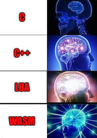

# Introduction

The purpose of this repository is to demo WASM (WebAssembly) execution on ESP32 WROVER development kit (version 4.1).
This work was inspired by https://github.com/wasm3/wasm3 interpreter and https://github.com/wasm3/wasm3-arduino examples.

Author: Mikolaj Stawiski



# Requirements

To build the template you'll need:
- Docker
- espressif/idf Docker image

Additionally if you want to run the firmware on the target you'll need:
- ESP32-WROVER-KIT (version 4.1)
- esptool script to upload the firmware onto the target

")

# Building and running on target

Remember to pull the submodules before build:
```
git submodule update --init --recursive
```

To build the firmware with Docker use the following command:
```
docker run --rm -v $PWD:/project -w /project espressif/idf idf.py build
```

To upload the firmware onto the target use the following command:
```
esptool.py -p USB_DEVICE -b 2000000 --before default_reset --after hard_reset --chip esp32  write_flash --flash_mode dio --flash_size detect --flash_freq 40m 0x10000 build/esp32-wasm-demos.bin
```

Where `USB_DEVICE` is the handle to the target board (on Mac it could be something like `/dev/cu.usbserial-XXX`).
